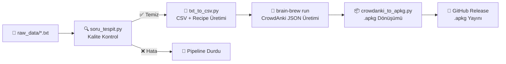

<h1 align="center">KamuSinyal KPSS Anki 2026</h1>

<p align="center">
  <strong>Akıllı Kart Destesiyle KPSS'ye Hazırlan</strong><br>
  Güncel, modüler ve otomatik olarak derlenen KPSS flash kartları — doğrudan Anki'ye aktarılmaya hazır.
</p>

<p align="center">
  <a href="#-özellikler">Özellikler</a> •
  <a href="#-kurulum--kullanım">Kurulum</a> •
  <a href="#-proje-mimarisi">Mimari</a> •
  <a href="#-build-pipeline">Pipeline</a> •
  <a href="#-yeni-soru-ekleme">Soru Ekleme</a> •
  <a href="#-kalite-kontrol-qa">Kalite Kontrol</a> •
  <a href="#-yerel-derleme">Yerel Derleme</a> •
  <a href="#-lisans">Lisans</a>
</p>

---

## 🎯 Nedir?

**KamuSinyal KPSS Anki**, Türkiye'nin en kapsamlı kamu kariyer platformu olan [KamuSinyal](https://kamusinyal.qzz.io/) ekosisteminin eğitim materyalleri ayağıdır. KPSS adaylarına yönelik, sıfırdan özel hazırlanmış flash kartlarını içerir.

Kartlar sıradan ezberleme yöntemi yerine **bağlam odaklı** hazırlanmıştır: her soru, sınavda çıkabilecek mantık örüntülerine göre şekillendirilmiş; hoca notları ve hafıza kodlamalarıyla zenginleştirilmiştir.

---

## ✨ Özellikler

| Özellik | Açıklama |
|---|---|
| 📚 **5 Ana Ders** | Tarih, Türkçe, Matematik, Vatandaşlık, Coğrafya |
| 🃏 **900+ Kart** | Sınavda çıkmış ve çıkması beklenen sorular |
| 🎨 **Yalın Tasarım** | Anki'nin gündüz/gece modlarıyla tam uyumlu, göz yormayan arayüz |
| ✏️ **Kolay İçerik Yönetimi** | Tüm kartlar düz `.txt` dosyalarından yönetilir, teknik bilgi gerekmez |
| ⚙️ **Otomatik Derleme** | Her yeni versiyon GitHub Actions ile otomatik test edilip yayınlanır |
| 🔍 **Kalite Kontrol (CI/CD)** | Yanlış format, eksik cevap veya tekrarlı sorular otomatik olarak tespit edilir |
| 📦 **Anında Kurulum** | `.apkg` formatı; Windows, Mac, Linux, Android ve iOS ile tam uyumludur |

---

## 📥 Kurulum & Kullanım

### 1. Desteleri İndirin

**[→ En Son Sürümü İndir](https://github.com/fr0stb1rd/kamusinyal-kpss-anki/releases/latest)**

Releases sayfasından istediğiniz derslere ait `.apkg` dosyalarını indirin.

---

### 💻 Masaüstü (Windows / Mac / Linux)

İndirilen `.apkg` dosyasına **çift tıklayın.** Anki otomatik olarak açılır ve desteyi içe aktarır.

Alternatif olarak: Anki → **Dosya** → **İçe Aktar** (`Ctrl + I`) → dosyayı seçin → **Aç**.

> ✅ *"X adet not eklendi"* mesajı görüntülenirse kurulum tamamdır.

---

### 📱 Android (AnkiDroid)

1. [AnkiDroid](https://play.google.com/store/apps/details?id=com.ichi2.anki) uygulamasını açın.
2. Sağ üst köşedeki **⋮ Menü** → **Desteyi İçe Aktar** seçeneğine dokunun.
3. Dosya yöneticisinden indirdiğiniz `.apkg` dosyasını bulun ve seçin.

---

### 🍏 iPhone / iPad (AnkiMobile)

1. Telefonunuzdaki **Dosyalar** uygulamasında `.apkg` dosyasına uzun basın.
2. **Paylaş** → [**AnkiMobile**](https://apps.apple.com/tr/app/ankimobile-flashcards/id373493387) seçeneğini seçin.
3. Anki otomatik olarak açılır ve desteyi koleksiyonunuza ekler.

---

## 🗂️ Proje Mimarisi

```
kamusinyal-kpss-anki/
│
├── src/                          ← Tüm proje kaynakları
│   ├── brain_brew_config.yaml    ← Brain Brew yapılandırması
│   │
│   ├── raw_data/                 ← Ham kaynak metin dosyaları (tek düzenleme noktası)
│   │   ├── cografya.txt
│   │   ├── tarih.txt
│   │   └── ...
│   │
│   ├── data/                     ← Üretilmiş geçici CSV dosyaları (gitignored)
│   │
│   ├── headers/                  ← Deste meta verileri (isim, UUID, açıklama)
│   │   ├── kpss_default.yaml
│   │   └── kpss_desc.html
│   │
│   ├── note_models/              ← Kart görünümü (CSS + HTML şablonu)
│   │   ├── kpss.css
│   │   ├── kpss.yaml
│   │   └── templates/
│   │       └── kpss_template.html
│   │
│   ├── recipes/                  ← Brain Brew tarifleri (dinamik üretilir)
│   │   └── kpss.yaml
│   │
│   └── scripts/                  ← Otomasyon betikleri
│       ├── txt_to_csv.py         ← raw_data/*.txt → CSV + recipe üretimi
│       ├── crowdanki_to_apkg.py  ← CrowdAnki JSON → .apkg dönüşümü
│       ├── soru_tespit.py        ← Kalite kontrol (CI/CD test adımı)
│       └── soru_duzelt.py        ← Hatalı soru işaretlerini otomatik düzeltme
│
├── build/                        ← Üretilen .apkg dosyaları (gitignored)
│   ├── KamuSinyal 2026 KPSS Coğrafya.apkg
│   └── ...
│
├── .github/workflows/
│   └── release.yml               ← Otomatik test, derleme ve GitHub Release
│
└── README.md
```

---

## ⚙️ Build Pipeline

Her `tag` push yapıldığında GitHub Actions aşağıdaki adımları sırasıyla çalıştırır:



---

## ✏️ Yeni Soru Ekleme

Yeni kart eklemek için tek yapılması gereken, ilgili **`src/raw_data/*.txt`** dosyasını düzenlemektir.

### Format

```
Soru metni buraya yazılır? Cevap metni buraya yazılır. (Opsiyonel hoca notu)
```

### Kural

Satırdaki **ilk `?` işareti** soruyu cevaptan ayırır.

```
✅ Doğru:  Türkiye'nin başkenti hangisidir? Ankara
❌ Yanlış: Türkiye'nin başkenti hangisi? Ankara mı İstanbul mu?
```

---

## 🔍 Kalite Kontrol (QA)

Her derleme öncesinde `soru_tespit.py` otomatik olarak çalışır ve aşağıdaki sorunları tespit edip **pipeline'ı durdurur:**

| Hata Tipi | Açıklama |
|---|---|
| ❌ **Soru işareti YOK** | Satırda hiç `?` bulunmayan başlık / açıklama satırları |
| ❌ **Çoklu `?` işareti** | Birden fazla soru işareti içeren, yanlış bölünecek satırlar |
| ❌ **Soru veya Cevap BOŞ** | `?` var ama soru/cevap kısmı boş kalmış satırlar |
| ❌ **Tekrarlı Soru** | Aynı soru metniyle birden fazla kez girilmiş satırlar |

Testi manuel olarak çalıştırmak için:

```bash
python3 src/scripts/soru_tespit.py
```

---

## 🛠️ Yerel Derleme

İlk kurulumda bağımlılıkları yükleyin:

```bash
python3 -m venv venv
./venv/bin/pip install brain-brew genanki
```

Tüm adımları tek komutla çalıştırın:

```bash
python3 src/scripts/soru_tespit.py && \
python3 src/scripts/txt_to_csv.py && \
./venv/bin/brain-brew run src/recipes/kpss.yaml && \
python3 src/scripts/crowdanki_to_apkg.py
```

Derlenen `.apkg` dosyaları saniyeler içinde **`build/`** klasöründe hazır olacaktır.

---

## 📄 Lisans

Bu proje [MIT](https://github.com/fr0stb1rd/kamusinyal-kpss-anki/blob/main/LICENSE) lisansı altında dağıtılmaktadır.

---

<p align="center">
  Bir <b><a href="https://kamusinyal.qzz.io">KamuSinyal</a></b> projesidir.
</p>
